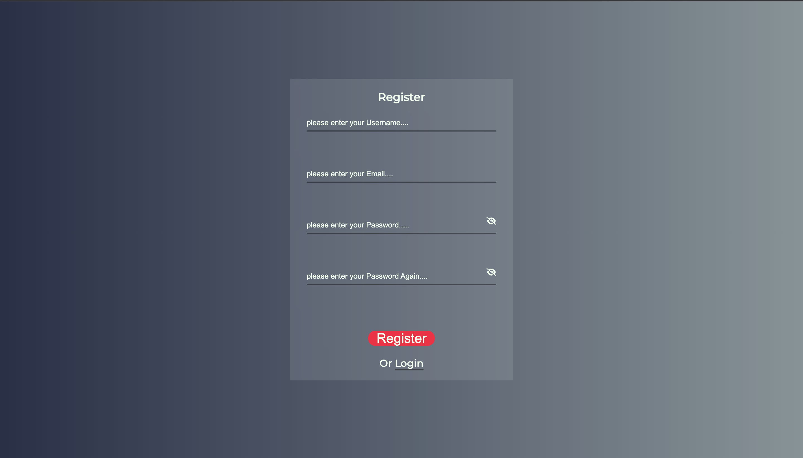

# E-commerce Full Stack App with Docker Compose

Full Stack Express Application With Docker Compose

## Live Demo




**[View Live Demo](https://express-shop.onrender.com)**

# Getting started

## Running locally

To get the Node server running locally:

- Clone this repo
- `npm install` to install all required dependencies
- Create .env file and specified these:

```bash
MONGO_URL = <your local or cloud mongodb url>
SESSION_SECRET = <your session secret phrase>
JWT = <your jwt scret phrase>
CLOUD_NAME = <your cloudinary cloud name>
CLOUD_API_KEY = <your cloudinary api key>
CLOUD_SECRET_KEY = <your cloudinary secret key>
STRIPE_SECRET_KEY = <your stripe secret key>
PORT = <any port>
URL = <http://localhost:${PORT}/stripe>
```
- Lastly npm start and go http://localhost:${PORT}>

## Running with docker-compose

To get the Node server running in docker with docker-compose:

- Clone this repo
- Create env directory and in env directory create mongo.env and backend.env:
- In the backend.env specified these:

```bash
SESSION_SECRET = <your session secret phrase>
JWT = <your jwt scret phrase>
CLOUD_NAME = <your cloudinary cloud name>
CLOUD_API_KEY = <your cloudinary api key>
CLOUD_SECRET_KEY = <your cloudinary secret key>
STRIPE_SECRET_KEY = <your stripe secret key>
URL = <http://localhost:3000/stripe>
MONGODB_USERNAME = <your username>
MONGODB_PASSWORD = <your password>
```

- In the mongo.env specified these:

```bash
MONGODB_USERNAME = <your username>
MONGODB_PASSWORD = <your password>
```
- Lastly application directory docker-compose up


# Code Overview

## Dependinces

- [expressjs](https://github.com/expressjs/express) - The server for handling and routing HTTP requests
- [jsonwebtoken](https://github.com/auth0/node-jsonwebtoken) - For generating JWTs used by authentication
- [mongoose](https://github.com/Automattic/mongoose) - For modeling and mapping MongoDB data to javascript 
- [joi](https://joi.dev/api/?v=17.7.0) - For handling validation and unique Validation error.
- [express-session](https://www.npmjs.com/package/express-session) - For handling user authentication
- [bcryptjs](https://openbase.com/js/bcryptjs/documentation) - For salt and hash passwords
- [cloudinary](https://cloudinary.com/documentation) - For save image in cloud
- [connect-flash](https://www.npmjs.com/package/connect-flash) - For custom messages show user
- [ejs](https://ejs.co/) - For custom html template
- [method-override](https://www.npmjs.com/package/method-override) - For handling custom put,delete,etc. requests
- [multer](https://www.npmjs.com/package/multer) - For handling save images
- [multer-storage-cloudinary](https://www.npmjs.com/package/multer-storage-cloudinary) - For handling save images in cloudinary
- [stripe](https://stripe.com/docs/payments/accept-a-payment) - For accept payments
- [connect-mongo](https://stripe.com/docs/payments/accept-a-payment) - For save session in mongo

## Application Structure

- `cloudinary/` - This folder contains custom function definitions for our Cloudinary configuration.
- `config/` - This folder contains configuration for database.
- `index.js` - The entry point to our application. This file defines our express server and connects it to MongoDB using mongoose. It also requires the routes and models we'll be using in the application.
- `controllers/` - This folder contains the function definitions for our API.
- `models/` - This folder contains the schema definitions for our Mongoose models.
- `public/` - This folder contains the static javascript,css and images.
- `routes/` - This folder contains the route definitions for our API.
- `utils/` - This folder contains custom function definitions for our API.
- `views/` - This folder contains ejs files.

## Authentication

Requests are authenticated using the session with a valid JWT. We define three custom routes(register,login and logout) in `routes/auth.js` that can be used to authenticate requests.we also define authentication functions in `controllers/auth.js`.We handle custom authentication middleware in `utils/verifyToken.js`.

## Other Features

### CSS Features

- Flip cart animation(in `public/css/admin/dashboard.css`)
- Product cart animation(in `public/css/products/products.css`)
- Window Pop-up animation(in `public/css/admin/dashboard.css`)

### JS Features
- Image upload functionality(in `public/scripts/others/imageUpload.js`)
- Mouse in-out animation(in `public/scripts/others/imageUpload.js`)
- Client-side validation(in `public/scripts/users/loginValidation.js-registerValidation.js` and `public/scripts/products/addProValidation.js-reviewValidation.js`)

### Others

- [docker](https://docs.docker.com/) - Create Dockerfile for build image in docker container
- [docker-compose](https://docs.docker.com/compose/) - Create docker-compose.yaml file for build image for declarative approach

## Copyright and License

Copyright 2022 [Enes Uraz](https://github.com/greatAlhazen). 
